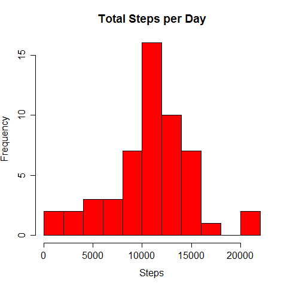
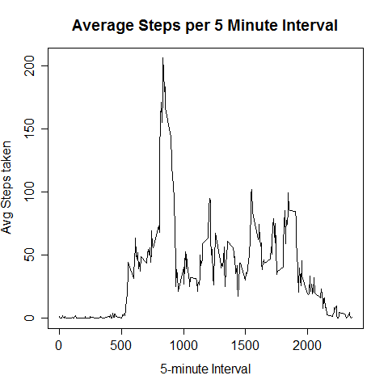
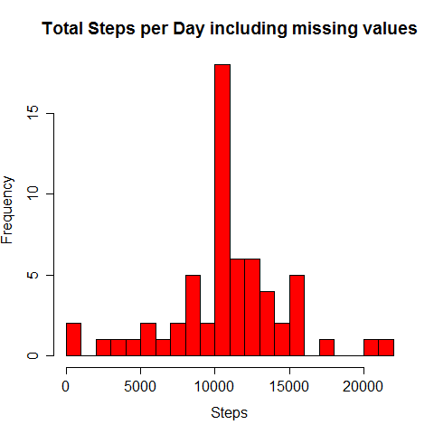
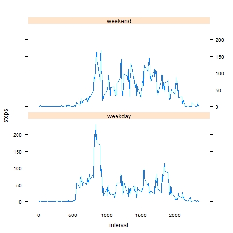

# Reproducible Research: Peer Assessment 1

## Introduction
This is my project on Reproducible Research course of the "Data Science Specialization". The file contains answers to "Reproducible Research Course Project 1" of this course.

##Sourcing of necessary packages

```r
library(knitr)
opts_chunk$set(echo = TRUE)
library(dplyr)	
library(lubridate)
library(lattice)
```


##Loading the data and preprocessing it.
#1. Load the data
##Below code checks the existence of the activity.csv file, and if file not found it downloads and unzips the zip file from provided link location.
	
	```r
	if (!file.exists("./UCI HAR Dataset")) {
		url <- "https://d396qusza40orc.cloudfront.net/repdata%2Fdata%2Factivity.zip"
		download.file(url, "Dataset.zip")
		unzip("Dataset.zip") 
	}
	activitydata <- read.table("activity.csv", header = TRUE, sep = ",", stringsAsFactors = TRUE)
	```
	
	2. Process/transform the data (if necessary) into a format suitable for your analysis
	### Formats the date to YYYY-MM-DD format.
	
	```r
	activitydata$date <- ymd(activitydata$date)
	```

##Mean total number of steps taken per day: Ignoring the missing values, i.e. NAs in the data.
	1. Calculating the total number of steps taken per day.
	
	```r
	steps_a_day <- data %>% 
		filter(!is.na(steps)) %>% 
		group_by(date) %>%
		summarize(steps = sum(steps))
	```
	2. Making a histogram of the total number of steps taken each day.
	
	```r
	hist(steps_a_day$steps, breaks = 10, xlab = "Steps", ylab = "Frequency", main = "Total Steps per Day", col = "red")
	```
	
	\
	
	3. Calculate and report the mean and median of the total number of steps taken per day.
	a. Mean of total number of steps taken per day is:
	
	```r
	mean_step <- mean(steps_a_day$steps, na.rm = TRUE)
	print(paste("Mean of total number of steps taken per day is: ", mean_step))
	```
	
	```
	## [1] "Mean of total number of steps taken per day is:  10766.1886792453"
	```
	
	b. Median of total number of steps taken per day is:
	
	```r
	median_step <- median(steps_a_day$steps, na.rm = TRUE)
	print(paste("Median of total number of steps taken per day is: ", median_step))
	```
	
	```
	## [1] "Median of total number of steps taken per day is:  10765"
	```

##Average daily activity pattern
	1. Make a time series plot (i.e. type = "l") of the 5-minute interval (x-axis) and the average number of steps taken, averaged across all days (y-axis)
	
	```r
	avg_step <- aggregate(steps ~ interval, data = activitydata, mean, na.rm = TRUE)
	
	plot(avg_step$interval, avg_step$steps, type="l", main="Average Steps per 5 Minute Interval", xlab="5-minute Interval", ylab="Avg Steps taken")
	```
	
	\
	2. Which 5-minute interval, on average across all the days in the dataset, contains the maximum number of steps?
	
	```r
	max_steps <- avg_step[which.max(avg_step$steps),]
	print(paste("Maximum number of steps in a 5-minute interval is: ", max_steps[1,2]))
	```
	
	```
	## [1] "Maximum number of steps in a 5-minute interval is:  206.169811320755"
	```
	
	```r
	print(paste("And the particular 5-minute interval is: ", max_steps[1,1]))
	```
	
	```
	## [1] "And the particular 5-minute interval is:  835"
	```
	
## Imputing missing values
	1. Calculate and report the total number of missing values in the dataset (i.e. the total number of rows with NAs)
	
	```r
	missing_values <- sum(is.na(activitydata$steps))
	print(paste("Total missing values: ", missing_values))
	```
	
	```
	## [1] "Total missing values:  2304"
	```
	
	2. Devise a strategy for filling in all of the missing values in the dataset. The strategy does not need to be sophisticated. For example, you could use the mean/median for that day, or the mean for that 5-minute interval, etc.
	
	The strategy I chose to fill in the missing values in the dataset is average number of steps in the same 5-min interval. .

	3. Create a new dataset that is equal to the original dataset but with the missing data filled in.
	
	```r
	new_data <- activitydata
	nas <- is.na(new_activitydata$steps)
	avg_interval <- tapply(new_activitydata$steps, new_activitydata$interval, mean, na.rm=TRUE, simplify=TRUE)
	new_activitydata$steps[nas] <- avg_interval[as.character(new_activitydata$interval[nas])]
	```
	
	# Check if there's any NA values. Answer is no, since the sum is 0.
	
	```r
	sum(is.na(new_activitydata$steps))
	```
	
	```
	## [1] 0
	```
	
	4. Make a histogram of the total number of steps taken each day and Calculate and report the mean and median total number of steps taken per day. Do these values differ from the estimates from the first part of the assignment? What is the impact of imputing missing data on the estimates of the total daily number of steps? and report the mean and median total number of steps taken per day. Do these values differ from the estimates from the first part of the assignment? What is the impact of imputing missing data on the estimates of the total daily number of steps?
	
	a. Making a histogram
	
	```r
	new_data_steps <- new_data %>%
				filter(!is.na(steps)) %>%
				group_by(date) %>%
				summarize(steps = sum(steps)) %>%
				print
	```
	
	```
	## Source: local data frame [61 x 2]
	## 
	##          date    steps
	##        (time)    (dbl)
	## 1  2012-10-01 10766.19
	## 2  2012-10-02   126.00
	## 3  2012-10-03 11352.00
	## 4  2012-10-04 12116.00
	## 5  2012-10-05 13294.00
	## 6  2012-10-06 15420.00
	## 7  2012-10-07 11015.00
	## 8  2012-10-08 10766.19
	## 9  2012-10-09 12811.00
	## 10 2012-10-10  9900.00
	## ..        ...      ...
	```
	
	```r
	hist(new_data_steps$steps, breaks=20, main="Total Steps per Day including missing values", xlab="Steps", ylab="Frequency", col = "red")
	```
	
	\
	
	b. Calculate and report the mean and median total number of steps taken per day
	
	```r
	new_mean <- mean(new_data_steps$steps)
	new_median <- median(new_data_steps$steps)
	
	print(paste("New mean is: ", new_mean))
	```
	
	```
	## [1] "New mean is:  10766.1886792453"
	```
	
	```r
	print(paste("New median is: ", new_median))
	```
	
	```
	## [1] "New median is:  10766.1886792453"
	```
	
	The impact of imputing missing data with the average number of steps in the same 5-min interval is that both the mean and the median are equal to the same value, which is 10766.19.
	
## Are there differences in activity patterns between weekdays and weekends?
	1. Create a new factor variable in the dataset with two levels – “weekday” and “weekend” indicating whether a given date is a weekday or weekend day.
	
	```r
	new_activitydata$date <- as.Date(new_activitydata$date)
	new_activitydata$dayname <- weekdays(new_activitydata$date)
	new_activitydata$weekend <- as.factor(ifelse(new_activitydata$dayname == "Saturday" |
									 new_activitydata$dayname == "Sunday", "weekend", "weekday"))
	```
	
	2. Make a panel plot containing a time series plot (i.e. type = "l") of the 5-minute interval (x-axis) and the average number of steps taken, averaged across all weekday days or weekend days (y-axis).
	
	```r
	plotdata <- aggregate(steps ~ interval + weekend, new_data, mean)
	xyplot(steps ~ interval | factor(weekend), data=plotdata, type="l")
	```
	
	\
